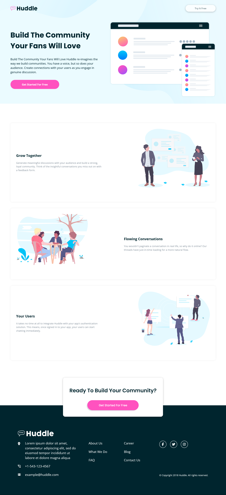

# Frontend Mentor - Huddle landing page with alternating feature blocks solution

This is a solution to the [Huddle landing page with alternating feature blocks challenge on Frontend Mentor](https://www.frontendmentor.io/challenges/huddle-landing-page-with-alternating-feature-blocks-5ca5f5981e82137ec91a5100). Frontend Mentor challenges help you improve your coding skills by building realistic projects.

## Table of contents

- [Overview](#overview)
  - [The challenge](#the-challenge)
  - [Screenshot](#screenshot)
  - [Links](#links)
- [Process](#process)
  - [Built with](#built-with)
  - [Workflow for contribution](#workflow-for-contribution)
- [Credits](#credits)

## Overview

### The challenge

Users should be able to:

- View the optimal layout for the site depending on their device's screen size
- See hover states for all interactive elements on the page

### Screenshot

### Links

- Solution URL: [Add solution URL here]()
- Live Site URL: [https://wonderful-cranachan-afb020.netlify.app/](https://wonderful-cranachan-afb020.netlify.app/)

## Process

### Built with

- HTML
- CSS

### Workflow for contribution

- Fork the repository (repo) to your own GitHub account
- Clone the project to your PC (Git)
- Create a new branch locally with a succinct but descriptive name
- Make changes (edit, delete, copy, add) on the new brach
- Commit changes to the branch
- Push changes to your fork (repo)
- Open a Pull Request (PR) in our repository and follow the PR template so that we can efficiently review the changes.
- Wait when your contribution will be accepted (merged) or declined to fix issues.

## Credits

Contributors:

- [@josh76543210](https://github.com/josh76543210)
- [@Leroy-sama](https://github.com/Leroy-sama)
- [@ShalomiAhavah](https://github.com/ShalomiAhavah)
